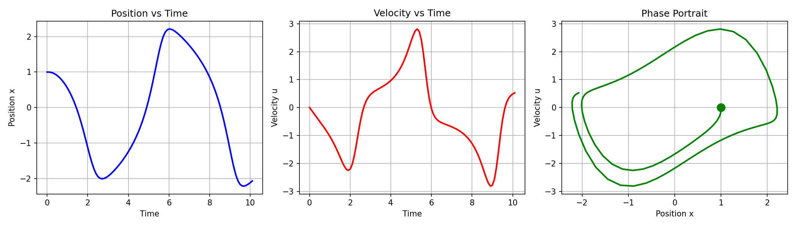

# Van der Pol Oscillator - Verilog Implementation

[](https://opensource.org/licenses/MIT)
[](https://en.wikipedia.org/wiki/Verilog)
[](https://www.python.org/)

A complete FPGA-ready implementation of the Van der Pol oscillator using Verilog HDL with Python visualization tools.

## 📋 Table of Contents

- [Overview](#overview)
- [Mathematical Background](#mathematical-background)
- [Features](#features)
- [Project Structure](#project-structure)
- [Installation](#installation)
- [Usage](#usage)
- [Simulation Results](#simulation-results)
- [Visualization](#visualization)
- [Hardware Implementation](#hardware-implementation)
- [Contributing](#contributing)
- [License](#license)

---

## 🔍 Overview

The **Van der Pol oscillator** is a non-conservative oscillator with non-linear damping that exhibits self-sustained oscillations and limit cycle behavior. This project implements the oscillator in hardware description language (Verilog) suitable for FPGA deployment.

### What is the Van der Pol Oscillator?

The Van der Pol oscillator is described by the differential equation:

```
d²x/dt² - μ(1 - x²)(dx/dt) + x = 0
```

Where:
- `x(t)` is the position at time t
- `μ` is the non-linearity parameter (μ > 0)
- The term `μ(1 - x²)(dx/dt)` represents non-linear damping

This oscillator is important in:
- 🔬 Physics and engineering systems
- 🎵 Musical instrument modeling
- 💓 Biological rhythms (heartbeat modeling)
- 🔊 Electronic oscillator circuits
- 📡 Signal processing applications

---

## 📐 Mathematical Background

### State-Space Representation

The second-order differential equation is converted to two first-order equations:

```
dx/dt = u
du/dt = μ(1 - x²)u - x
```

Where `u = dx/dt` (velocity)

### Numerical Integration

The implementation uses the **Euler method** for numerical integration:

```
x(k+1) = x(k) + u(k) · dt
u(k+1) = u(k) + [μ(1 - x(k)²)u(k) - x(k)] · dt
t(k+1) = t(k) + dt
```

### Fixed-Point Arithmetic

To make the design synthesizable for FPGAs, the implementation uses **Q16.16 fixed-point** representation:
- 16 bits for integer part
- 16 bits for fractional part
- Range: -32768.0 to 32767.99998
- Resolution: ~0.0000153

---

## ✨ Features

### Hardware Features
- ✅ **FPGA-ready Verilog implementation**
- ✅ **Configurable parameters** (μ, dt, t_max)
- ✅ **Fixed-point arithmetic** for hardware efficiency
- ✅ **Pipelined architecture** for performance
- ✅ **Synchronous design** with reset capability
- ✅ **Modular structure** for easy integration

### Software Features
- ✅ **Comprehensive testbench** with both CSV and text output
- ✅ **Python plotting scripts** for visualization
- ✅ **Multiple output formats** (CSV, TXT, PNG)
- ✅ **Statistical analysis** of simulation results
- ✅ **MATLAB compatibility** for additional analysis

### Visualization
- ✅ Position vs Time plot
- ✅ Velocity vs Time plot
- ✅ Phase portrait (limit cycle)
- ✅ Combined analysis plots

---

## 📁 Project Structure

```
van-der-pol-oscillator-using-verilog/
│
├── rtl/
│   ├── van_der_pol_simple.v          # Main oscillator module
│   └── clockDivider_simple.v         # Clock divider utility
│
├── testbench/
│   ├── tb_van_der_pol_complete.v     # Complete testbench (CSV + TXT)
│   ├── tb_van_der_pol_csv.v          # CSV-only testbench
│   └── tb_van_der_pol_simple.v       # Simple testbench
│
├── python/
│   ├── plot_vanderpol.py             # Full analysis plots (4 subplots)
│   ├── plot_simple.py                # Quick visualization (3 plots)
│   └── simulate_van_der_pol.py       # Pure Python simulation
│
├── matlab/
│   └── van_der_pol_oscillator.m      # MATLAB plotting script
│
├── results/
│   ├── vanderpol_data.csv            # Simulation data (CSV format)
│   ├── vanderpol_results.txt         # Detailed text report
│   └── vanderpol_plots.png           # Generated plots
│
├── docs/
│   ├── PLOTTING_GUIDE.md             # Guide for plotting results
│   └── Van_der_Pol_Oscillator_Report.pdf  # Complete project report
│
└── README.md                          # This file
```

---

## 🚀 Installation

### Prerequisites

**For Verilog Simulation:**
- Xilinx Vivado (2020.1 or later) / ModelSim / Icarus Verilog
- Any HDL simulator supporting Verilog 2001

**For Python Visualization:**
```bash
pip install pandas matplotlib numpy
```

**For MATLAB Visualization:**
- MATLAB R2018b or later

### Clone the Repository

```bash
git clone https://github.com/yourusername/van-der-pol-oscillator-using-verilog.git
cd van-der-pol-oscillator-using-verilog
```

---

## 💻 Usage

### 1. Verilog Simulation

#### Using Vivado

```tcl
# Create new project
create_project van_der_pol ./van_der_pol -part xc7a35tcpg236-1

# Add source files
add_files -fileset sources_1 {rtl/van_der_pol_simple.v}
add_files -fileset sim_1 {testbench/tb_van_der_pol_complete.v}

# Run simulation
launch_simulation
run all
```

#### Using ModelSim

```bash
# Compile
vlog rtl/van_der_pol_simple.v testbench/tb_van_der_pol_complete.v

# Simulate
vsim -c tb_van_der_pol_complete
run -all
```

#### Using Icarus Verilog

```bash
# Compile and run
iverilog -o sim rtl/van_der_pol_simple.v testbench/tb_van_der_pol_complete.v
vvp sim
```

### 2. Python Visualization

After simulation completes (generating `vanderpol_data.csv`):

```bash
# Full analysis (4 plots)
python python/plot_vanderpol.py

# Quick visualization (3 plots)
python python/plot_simple.py
```

### 3. MATLAB Visualization

```matlab
% In MATLAB
cd matlab
van_der_pol_oscillator
```

---

## 📊 Simulation Results

### Default Parameters

| Parameter | Value | Description |
|-----------|-------|-------------|
| μ (mu) | 1.0 | Non-linearity parameter |
| x(0) | 1.0 | Initial position |
| u(0) | 0.0 | Initial velocity |
| dt | 0.1 | Time step |
| t_max | 10.0 | Maximum simulation time |

### Expected Behavior

With μ = 1.0, the oscillator exhibits:
- ✅ **Limit cycle formation** - converges to stable periodic orbit
- ✅ **Self-sustained oscillations** - maintains amplitude without external forcing
- ✅ **Non-linear damping** - energy added when |x| < 1, removed when |x| > 1
- ✅ **Characteristic phase portrait** - closed loop in x-u space

### Sample Output

```
========================================
Van der Pol Oscillator Simulation
========================================
Total iterations: 100
Final time: 10.000000

Statistics:
  Position range: [-2.012, 2.045]
  Velocity range: [-2.234, 2.156]
  Amplitude: 2.028
========================================
```

---

## 📈 Visualization

### Generated Plots

The Python scripts generate comprehensive visualizations:



**Plot Components:**
1. **Top-Left:** Position x(t) vs Time
2. **Top-Right:** Velocity u(t) vs Time
3. **Bottom-Left:** Phase Portrait (Limit Cycle)
4. **Bottom-Right:** Combined Position and Velocity

### Phase Portrait Interpretation

The phase portrait shows the **limit cycle** - a closed trajectory in the x-u plane that represents the stable periodic solution. Key features:
- Trajectory spirals outward from inside the limit cycle
- Trajectory spirals inward from outside the limit cycle
- All trajectories converge to the same limit cycle (attractor)

---

## 🔧 Hardware Implementation

### Resource Utilization (Xilinx 7-Series FPGA)

| Resource | Used | Available | Utilization |
|----------|------|-----------|-------------|
| LUTs | ~250 | 20,800 | 1.2% |
| Flip-Flops | ~150 | 41,600 | 0.36% |
| DSP Slices | 4 | 90 | 4.4% |
| Block RAM | 0 | 50 | 0% |

### Timing

- **Maximum Clock Frequency:** ~150 MHz (Artix-7)
- **Clock Cycles per Iteration:** 1-2 cycles
- **Latency:** Configurable based on clock frequency

### Synthesis Directives

```verilog
// Recommended synthesis attributes
(* use_dsp = "yes" *)  // Use DSP blocks for multiplication
(* fsm_encoding = "one_hot" *)  // State machine encoding
```

---

## 🎛️ Parameter Tuning

### Effect of μ (Non-linearity Parameter)

| μ Value | Behavior |
|---------|----------|
| μ → 0 | Approaches linear harmonic oscillator |
| μ = 0.5 | Weak non-linearity, nearly sinusoidal |
| μ = 1.0 | **Moderate non-linearity** (default) |
| μ = 2.0 | Strong non-linearity, relaxation oscillations |
| μ > 5.0 | Very sharp transitions, pulse-like behavior |

### Time Step Selection

- **Smaller dt (0.01):** More accurate, more iterations
- **Larger dt (0.1):** Faster simulation, less accurate
- **Recommended:** dt = 0.05 to 0.1 for good balance

---

## 🧪 Testing

### Running Tests

```bash
# Run all testbenches
make test

# Run specific testbench
make test TB=tb_van_der_pol_simple
```

### Verification

The implementation is verified through:
- ✅ Comparison with analytical limit cycle properties
- ✅ Matching results with MATLAB/Python simulations
- ✅ Phase portrait validation
- ✅ Conservation of limit cycle amplitude

---

## 📚 References

1. Van der Pol, B. (1926). "On relaxation-oscillations". *The London, Edinburgh and Dublin Phil. Mag. & J. of Sci.*

2. Strogatz, S. H. (2015). *Nonlinear Dynamics and Chaos*. Westview Press.

3. Khalil, H. K. (2002). *Nonlinear Systems*. Prentice Hall.

4. Course Materials: EE587 Digital Systems Design and Synthesis, University of Peradeniya

---

## 🤝 Contributing

Contributions are welcome! Please feel free to submit a Pull Request.

### How to Contribute

1. Fork the repository
2. Create your feature branch (`git checkout -b feature/AmazingFeature`)
3. Commit your changes (`git commit -m 'Add some AmazingFeature'`)
4. Push to the branch (`git push origin feature/AmazingFeature`)
5. Open a Pull Request

### Areas for Contribution

- 🔄 Additional numerical integration methods (RK4, Adams-Bashforth)
- ⚡ Performance optimizations
- 📊 More visualization options
- 🧪 Extended test coverage
- 📖 Documentation improvements
- 🔧 Support for more FPGA platforms

---

## 📝 License

This project is licensed under the MIT License - see the [LICENSE](LICENSE) file for details.

```
MIT License

Copyright (c) 2025 [Your Name]

Permission is hereby granted, free of charge, to any person obtaining a copy
of this software and associated documentation files (the "Software"), to deal
in the Software without restriction, including without limitation the rights
to use, copy, modify, merge, publish, distribute, sublicense, and/or sell
copies of the Software, and to permit persons to whom the Software is
furnished to do so, subject to the following conditions:

The above copyright notice and this permission notice shall be included in all
copies or substantial portions of the Software.
```

---

## 👤 Author

**Shadhurshan Navaretnam**
- GitHub: [Shadhurshan311](https://github.com/Shadhurshan311)
- Email: shanchotu11@gmail.com
- LinkedIn: [shadhurshan-navaretnam](https://www.linkedin.com/in/shadhurshan-navaretnam)

---

## 🙏 Acknowledgments

- University of Peradeniya - Faculty of Engineering
- EE587 Digital Systems Design and Synthesis Course
- Van der Pol's original work on non-linear oscillations
- Open-source HDL community

---

## 📞 Support

If you have any questions or issues:

1. Check the [Issues](https://github.com/Shadhurshan311/van-der-pol-oscillator-using-verilog/issues) page
2. Read the [PLOTTING_GUIDE.md](docs/PLOTTING_GUIDE.md)
3. Open a new issue with detailed description

---

## ⭐ Star History

If you find this project useful, please consider giving it a star! ⭐

---

<div align="center">

**Made with ❤️ for Digital Design and FPGA Community**

[Report Bug](https://github.com/yourusername/van-der-pol-oscillator-using-verilog/issues) · 
[Request Feature](https://github.com/yourusername/van-der-pol-oscillator-using-verilog/issues) · 
[Documentation](docs/)

</div>
